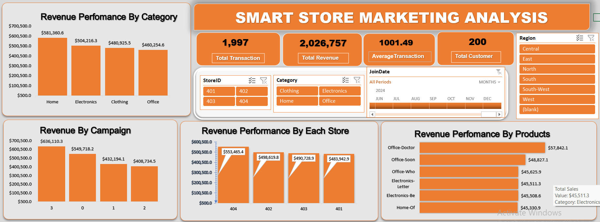
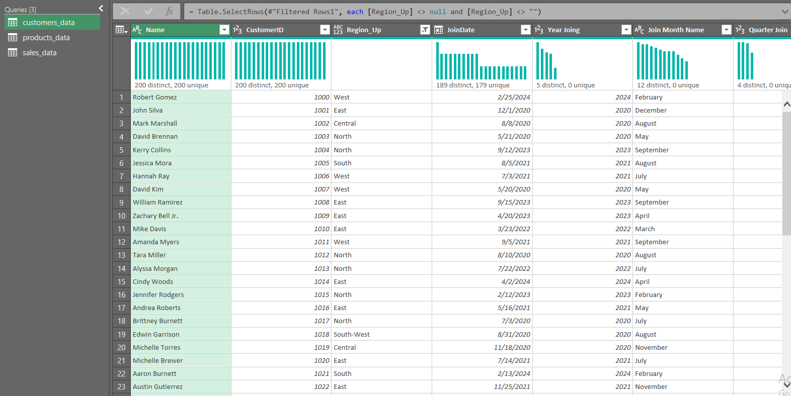
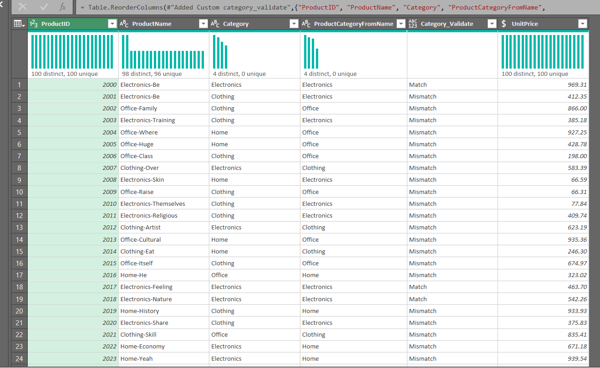
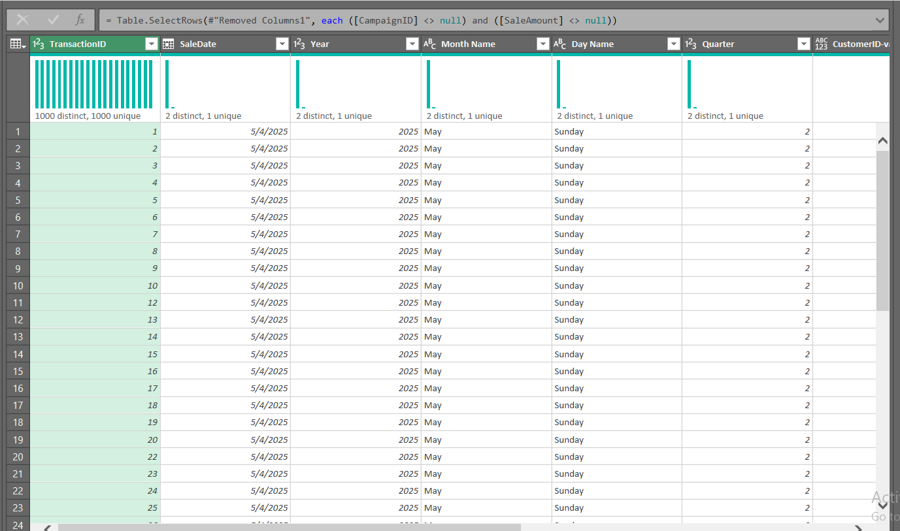
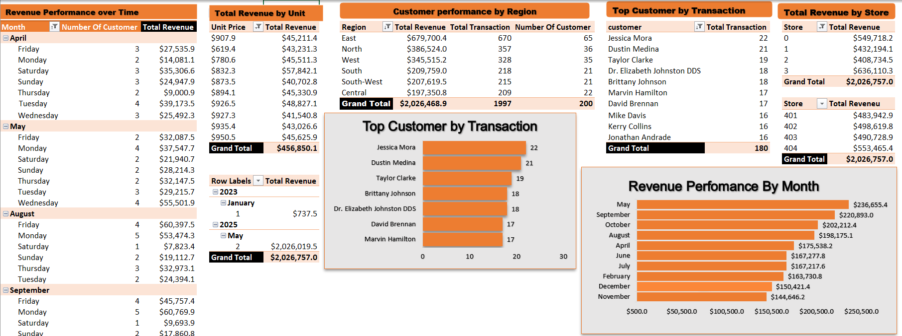
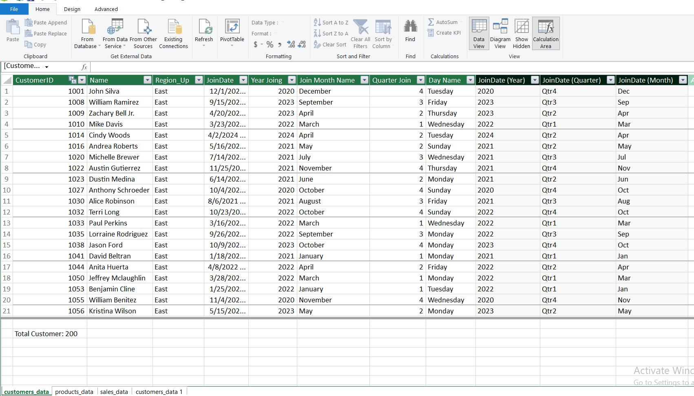
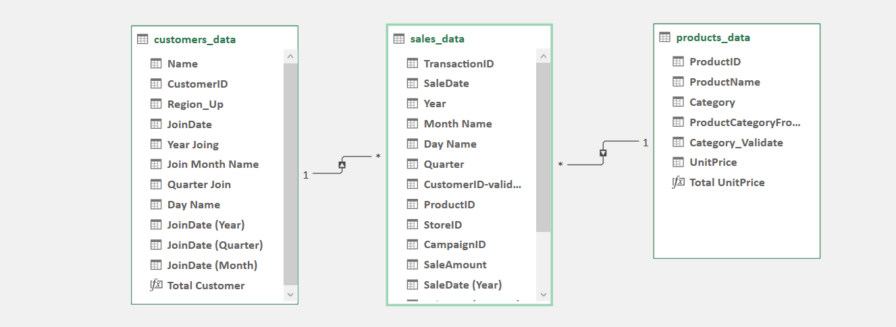

#  SMART STORE ANALYSIS

### Sales, Customer & Business Performance Analysis Using Microsoft Excel

Smart Store Analysis is an Excel-based business intelligence project that analyzes retail sales data to understand revenue performance across products, categories, customers, regions, stores, and campaigns. The project follows an end-to-end analytics workflow from raw data preparation to dashboard development and business insights.


## Executive Summary

Smart Store Analysis was developed to transform raw retail transaction data into a structured business reporting solution.

The analysis combines customer, product, and sales data to provide visibility into revenue performance across different business dimensions. The project also identifies data-quality issues that could affect reporting accuracy and validates the data before analysis.

The final solution provides an interactive Excel dashboard containing key performance indicators, revenue comparisons, product performance, campaign analysis, store performance, and filtering capabilities.


# Business Challenge

Retail businesses need reliable visibility into sales performance to understand where revenue is being generated and which areas require further investigation.

The raw dataset contains information about customers, products, and sales transactions, but several data-quality issues were identified, including duplicate records, inconsistent region values, an invalid sales date, missing campaign information, an invalid customer reference, and non-numeric sales values.

The challenge was to prepare the data for analysis and develop a reporting solution that makes sales performance easier to understand across multiple business dimensions.

# Project Objectives

## Business Objectives

The analysis aims to help answer questions such as:

- Which product categories generate the most revenue?
- Which products perform strongest?
- Which regions contribute the most revenue?
- Which stores generate the highest revenue?
- How does revenue vary across campaigns?
- Which customers contribute significant sales activity?
- What data-quality issues could affect reporting reliability?

## Technical Objectives

- Profile the raw datasets
- Identify data-quality issues
- Clean and transform the data using Power Query
- Validate customer, product, and sales relationships
- Analyze the data using Excel
- Develop KPIs and summary calculations
- Build an interactive dashboard
- Communicate findings through business-oriented visualizations


# Dashboard Preview

## Smart Store Analysis Dashboard



The dashboard provides a consolidated view of sales performance through KPI cards, category revenue, campaign revenue, store performance, product revenue, and interactive filters.

### Dashboard KPIs

| KPI | Dashboard Value |
|---|---:|
| Total Transactions | 1,997 |
| Total Revenue | $2,026,757 |
| Average Transaction | $1,001.49 |
| Total Customer | 200 |

The dashboard also includes filters for **Region, StoreID, Category, and JoinDate**, allowing users to investigate performance from different perspectives.


# Dataset Overview

The project uses three related datasets:

| Dataset | Source Records | Columns | Purpose |
|---|---:|---:|---|
| Customers | 201 | 4 | Customer information, region and join date |
| Products | 100 | 4 | Product information, category and unit price |
| Sales | 2,001 | 7 | Transaction-level sales information |

### Data Structure

**Customers**

Contains customer-level information including:

- CustomerID
- Name
- Region
- JoinDate

**Products**

Contains product-level information including:

- ProductID
- ProductName
- Category
- UnitPrice

**Sales**

Contains transaction-level information including:

- TransactionID
- SaleDate
- CustomerID
- ProductID
- StoreID
- CampaignID
- SaleAmount

The Sales table provides the transaction activity used to analyze revenue across customer and product attributes.

# Business Understanding

The dashboard is designed primarily for stakeholders interested in monitoring sales and commercial performance.

### Relevant Stakeholders

- Sales Managers
- Store Managers
- Business Managers
- Management
- Campaign/Marketing Teams

The dashboard allows stakeholders to compare performance across categories, products, stores, regions, and campaigns while investigating customer activity.


# Project Workflow

```text
Business Understanding
        ↓
Data Profiling
        ↓
Data Cleaning
        ↓
Data Validation
        ↓
Data Transformation
        ↓
Data Modeling
        ↓
Analysis
        ↓
KPI Development
        ↓
Dashboard Development
        ↓
Insight Generation
        ↓
Business Recommendations
````

--

# Data Cleaning & Transformation

Data cleaning was performed using **Power Query** to prepare the raw datasets for analysis.

## Customer Data Cleaning



The customer dataset was reviewed for duplicate records, inconsistent regional values, and date formatting.

### Duplicate Customer Record

CustomerID `1005` appears twice in the source data.

This creates 201 source records but only 200 unique CustomerIDs.

Duplicate records can affect customer counts and downstream analysis if they are not identified.

### Region Inconsistency

The Region field contains variations such as:

* `East`
* `EAST`
* `east`
* `south-west`

These values require standardization so that regional comparisons are not split across different text representations.

## Product Data Cleaning



The Products dataset was reviewed for product identifiers, product names, categories, and numeric price values.

ProductID values are unique.

However, some ProductName values appear more than once. Duplicate product names were not automatically removed because **ProductID is the identifier of the product record**.

### Category Validation

Some ProductName values contain prefixes such as:

* Office
* Clothing
* Home
* Electronics

However, these prefixes do not consistently match the Category field.

Rather than automatically replacing the Category field, the mismatch should be treated as a validation issue because the source data does not establish that the ProductName prefix is the authoritative category.


## Sales Data Cleaning



The Sales dataset was reviewed for duplicate transactions, dates, numeric values, missing campaign information, and customer references.

### Duplicate Transaction

TransactionID `6` appears twice with identical transaction information.

This duplicate can inflate transaction and revenue calculations if left untreated.

### Invalid Sale Date

One transaction contains:

`2023-13-01`

The value contains an invalid month and should not be automatically converted into another date without a documented business rule.

### Invalid Sale Amount

The SaleAmount field contains a `?` value.

This represents an unknown/non-numeric value and should be treated as missing rather than being converted to zero.

### Zero-Value Transactions

The dataset contains 284 transactions with a SaleAmount of zero.

These records were not automatically classified as errors because the available data does not explain whether they represent promotions, cancellations, returns, or another business condition.

### Missing Campaign

One sales record has a missing CampaignID.

The available data does not establish whether a blank CampaignID means "no campaign" or represents missing data, so it should be treated as a validation issue.

### Unmatched Customer

One sales transaction references CustomerID `9999`, which does not exist in the Customers dataset.

This is a referential-integrity issue that should be investigated before relying on customer-level analysis.


# Data Quality Analysis



The data-quality review identified several issues that could affect the reliability of business reporting.

| Issue                   | Finding |
| ----------------------- | ------: |
| Customer source records |     201 |
| Unique CustomerIDs      |     200 |
| Duplicate TransactionID |       1 |
| Invalid SaleDate        |       1 |
| Non-numeric SaleAmount  |       1 |
| Zero-value transactions |     284 |
| Missing CampaignID      |       1 |
| Unmatched CustomerID    |       1 |

These findings highlight the importance of validating transactional data before using it for business reporting.

> A single record can contain more than one issue, so issue counts should not automatically be added together.


# Data Modeling

## Data Model



The project uses three main datasets:

```text
Customers
    │
    │ CustomerID
    ↓
  Sales
    │
    │ ProductID
    ↓
Products
```

The Sales dataset provides transaction-level activity, while Customers and Products provide additional descriptive information.

## Relationships



The primary analytical relationships are based on:

* `Customers[CustomerID]` → `Sales[CustomerID]`
* `Products[ProductID]` → `Sales[ProductID]`

These relationships allow sales transactions to be analyzed using customer and product attributes.

StoreID and CampaignID are available directly within the Sales dataset. No separate Store or Campaign dimension was provided in the source data.


# Dashboard Walkthrough

## 1. Sales Performance Overview


### Purpose

The dashboard provides a consolidated view of the store's reported sales performance.

### Key KPIs

* Total Transactions: **1,997**
* Total Revenue: **$2,026,757**
* Average Transaction: **$1,001.49**
* Total Customers: **200**

### Key Visualizations

* Revenue by Category
* Revenue by Campaign
* Revenue by Store
* Revenue by Product
* Interactive Region filter
* StoreID filter
* Category filter
* JoinDate filter

### Business Questions

This dashboard helps users investigate:

* How much revenue is being generated?
* Which categories perform best?
* Which campaigns generate the most reported revenue?
* Which stores perform best?
* Which products contribute strongly to revenue?
* How does performance change when different filters are applied?


# Revenue Performance by Category

The dashboard reports the following category revenue:

| Category    |     Revenue |
| ----------- | ----------: |
| Home        | $581,360.60 |
| Electronics | $504,216.30 |
| Clothing    | $480,925.50 |
| Office      | $460,254.60 |

### Finding

**Home** records the highest reported revenue at **$581,360.60**, while **Office** records the lowest among the four categories at **$460,254.60**.

The comparison allows management to monitor differences in category contribution.

# Revenue by Campaign

| Campaign |     Revenue |
| -------- | ----------: |
| 3        | $636,110.30 |
| 0        | $549,718.20 |
| 1        | $432,194.10 |
| 2        | $408,734.50 |

### Finding

Campaign **3** records the highest reported revenue at approximately **$636,110**, while Campaign **2** records the lowest at approximately **$408,735**.

This identifies a clear difference in revenue generated across campaign IDs.

However, the dataset does not contain campaign costs, conversions, impressions, or profit. Therefore, these figures **cannot be used to calculate campaign ROI or prove marketing effectiveness**.


# Revenue Performance by Store

| Store |     Revenue |
| ----- | ----------: |
| 404   | $553,465.40 |
| 402   | $498,619.80 |
| 403   | $490,728.90 |
| 401   | $483,942.90 |

### Finding

Store **404** records the highest reported revenue at approximately **$553,465**.

The dashboard makes it possible to compare store performance, but additional operational information would be required to determine why Store 404 performs differently.

# Revenue Performance by Products

The dashboard highlights the highest-revenue products, including:

* Office-Doctor
* Office-Soon
* Office-Who
* Electronics-Letter
* Electronics-Be
* Home-Of

### Business Value

The product comparison provides visibility into which individual products contribute strongly to reported revenue and can help management identify products that warrant further investigation.


# Business Questions Answered

The analysis supports questions such as:

1. What is the total reported revenue?
2. How many transactions are reported?
3. What is the average transaction value?
4. How many customers are represented?
5. Which category generates the highest revenue?
6. Which category generates the lowest revenue?
7. How does Electronics compare with Home?
8. Which campaign generates the highest reported revenue?
9. Which campaign generates the lowest reported revenue?
10. Which store generates the highest revenue?
11. Which store generates the lowest revenue?
12. Which products generate the highest reported revenue?
13. How does revenue vary by region?
14. Which regions contribute the most revenue?
15. Which customers contribute significant sales activity?
16. How does performance change by category?
17. How does performance change by store?
18. How does performance change by region?
19. How does performance change across campaigns?
20. Which data-quality issues could affect the reliability of the analysis?


# KPIs

| KPI                 | Definition                                       | Business Importance                           |
| ------------------- | ------------------------------------------------ | --------------------------------------------- |
| Total Transactions  | Number of transactions reported by the dashboard | Measures transaction volume                   |
| Total Revenue       | Total reported sales revenue                     | Provides an overall view of sales performance |
| Average Transaction | Average revenue generated per transaction        | Helps evaluate average transaction value      |
| Total Customer      | Number of customers represented in the dashboard | Provides visibility into the customer base    |

### Dashboard KPI Values

* **1,997** Total Transactions
* **$2,026,757** Total Revenue
* **$1,001.49** Average Transaction
* **200** Total Customers


# Business Insights

## Insight 1 — Home leads category revenue

The analysis shows that Home generates **$581,360.60**, the highest revenue among the four categories.

This makes Home an important contributor to reported sales performance and a category worth monitoring.

## Insight 2 — Campaign 3 has the highest reported campaign revenue

Campaign 3 generates approximately **$636,110**, exceeding the revenue reported for the other campaign IDs.

The difference identifies Campaign 3 as the strongest campaign by revenue in the available dataset.

However, additional campaign data would be required to determine whether this represents stronger efficiency or profitability.


## Insight 3 — Store 404 leads store revenue

Store 404 generates approximately **$553,465**, the highest revenue among the four stores.

The result identifies Store 404 as the strongest reported store by revenue, but the available dataset does not provide enough information to determine the cause.


## Insight 4 — Revenue is distributed across all four categories

Although Home has the highest revenue, Electronics, Clothing, and Office also generate substantial revenue.

This indicates that reported sales are distributed across multiple product categories rather than being concentrated entirely in one category.


## Insight 5 — Data quality requires attention

The raw data contains duplicate records, inconsistent region values, an invalid date, a non-numeric sales amount, zero-value transactions, a missing campaign value, and an unmatched customer reference.

These issues demonstrate that data validation is an important part of producing reliable sales reporting.


# Business Recommendations

## 1. Monitor Home category performance

**Recommendation:** Continue monitoring Home category revenue and compare its performance with other categories over future reporting periods.

**Reason:** Home currently records the highest reported category revenue.

**Expected Value:** Consistent category monitoring can help identify changes in category contribution.

## 2. Investigate Campaign 3

**Recommendation:** Review the activities and costs associated with Campaign 3 before making decisions about additional investment.

**Reason:** Campaign 3 records the highest reported campaign revenue.

**Expected Value:** Additional campaign information could determine whether the higher revenue also represents stronger efficiency or profitability.


## 3. Investigate Store 404 performance

**Recommendation:** Compare Store 404 with the other stores using additional operational information.

**Reason:** Store 404 records the highest reported store revenue.

**Expected Value:** Further investigation may identify operational or commercial factors associated with the difference.

## 4. Strengthen data-quality controls

**Recommendation:** Introduce validation checks for duplicate IDs, invalid dates, missing values, numeric fields, and unmatched references.

**Reason:** Several data-quality issues were identified in the source data.

**Expected Value:** Stronger validation can reduce the risk of inaccurate reporting.


# Technical Highlights

### Microsoft Excel

Used as the primary environment for analysis, PivotTables, calculations, visualizations, and dashboard development.

### Power Query

Used to profile, clean, transform, and validate the raw datasets.

### PivotTables

Used to summarize and compare sales performance across different business dimensions.

### Data Modeling

Customers, Products, and Sales were structured to support analysis across customer and product attributes.

### Dashboard Design

An interactive Excel dashboard was developed using KPI cards, charts, and slicers.


# Challenges Encountered

## Duplicate Records

Duplicate customer and transaction records were identified.

**Impact:** Duplicates can inflate counts and revenue calculations.

**Solution:** Duplicate records were identified during data profiling and validation.

**Lesson:** Unique identifiers should be checked before calculating business metrics.


## Inconsistent Categories and Regions

The source data contains inconsistent text values and product/category mismatches.

**Impact:** Inconsistent values can split the same business category into multiple groups.

**Solution:** Values were reviewed and validation rules were considered before standardization.

**Lesson:** Cleaning should preserve business meaning rather than blindly replacing source values.

## Invalid Transaction Data

The Sales dataset contains an invalid date, a non-numeric amount, zero-value transactions, and an unmatched customer reference.

**Impact:** These records can affect calculations and relationships.

**Solution:** Problematic records were identified and treated as data-quality issues requiring cleaning or investigation.

**Lesson:** Data validation is essential before using transactional data for reporting.

# Future Improvements

## Historical Sales Data

The available Sales data is heavily concentrated around a single sales date, limiting meaningful time-series analysis.

A larger historical dataset would enable:

* Monthly sales trends
* Seasonal analysis
* Growth analysis
* Forecasting


## Campaign ROI Analysis

Adding campaign cost, impressions, conversions, and profit would allow campaign efficiency and ROI to be evaluated rather than revenue alone.


## Store Performance Analysis

Additional store attributes such as location, operating costs, store size, and staffing could help explain differences between stores.


## Automated Data-Quality Checks

Future versions could include automated checks for:

* Duplicate IDs
* Missing values
* Invalid dates
* Invalid numeric values
* Referential-integrity issues
* Category inconsistencies


## Advanced Customer Analysis

Additional customer attributes and longer purchasing histories could support deeper customer segmentation and purchasing-behavior analysis.

# Conclusion

Smart Store Analysis demonstrates an end-to-end approach to transforming raw retail data into a structured Excel business intelligence solution.

The project combines data cleaning, validation, transformation, modeling, analysis, KPI development, visualization, and dashboard design to provide visibility into sales performance across products, categories, customers, regions, stores, and campaigns.

The analysis identifies meaningful differences in category, campaign, and store revenue while also highlighting data-quality limitations that should be considered before making deeper business decisions.

The project demonstrates that effective analytics is not only about building dashboards, but about **understanding the data, asking relevant business questions, validating the results, and turning evidence into useful business insight.**


# About the Author

**ZACCH** is a Computer Science student and aspiring Data Analyst focused on transforming raw data into meaningful business insights through data analytics and business intelligence.

My work focuses on **Excel, SQL, Power BI, Power Query, DAX, data cleaning, data visualization, and analytical problem-solving**.

I am interested in building practical analytics solutions that connect technical analysis with real business decisions.

### Connect With Me
* **LinkedIn:** [Your LinkedIn Profile](linkedin/zacchtech)
* **Email:** [Your Email](aladezaccheous52@gmail.com)


# Tools Used

**Microsoft Excel | Power Query | PivotTables | Data Modeling | Excel Charts & Dashboard**


